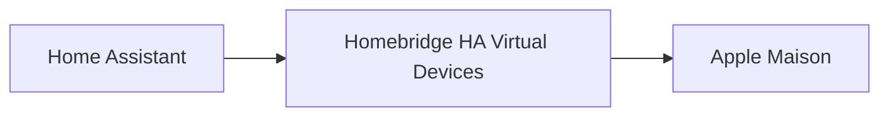

# Homebridge HA Virtual Devices

Expose automatiquement les capteurs environnementaux compatibles de Home Assistant sous forme d'accessoires Thermostat natifs dans Apple Maison.

Homebridge HA Virtual Devices détecte automatiquement les capteurs environnementaux compatibles de Home Assistant et les expose sous forme d'accessoires Thermostat natifs dans Apple Maison.

Au lieu d'afficher plusieurs accessoires indépendants pour la température, l'humidité ou le niveau de batterie, Apple Maison présente un unique Thermostat regroupant les informations environnementales les plus utiles.

Aucun mappage manuel.

Aucun accessoire dupliqué.

Aucun polling.

Une expérience Apple Maison entièrement native.

> La réalité avant tout.
> Toutes les captures d'écran présentées dans cette documentation proviennent d'une installation réelle du plugin. Les informations personnelles ont été anonymisées lorsque cela était nécessaire.


---

## Pourquoi ce plugin ?

Home Assistant est une excellente plateforme pour collecter les données provenant de nombreux capteurs environnementaux.

Apple Maison offre l'une des meilleures expériences utilisateur pour piloter son habitation au quotidien.

Homebridge HA Virtual Devices relie automatiquement ces deux écosystèmes en regroupant les mesures compatibles dans des accessoires HomeKit entièrement natifs.

Le résultat est une interface Apple Maison plus propre, plus lisible et parfaitement intégrée.

---

## Fonctionnalités

### Découverte automatique

- Détection automatique des appareils compatibles Home Assistant
- Aucun mappage manuel
- Création automatique des accessoires
- Regroupement automatique des mesures d'un même appareil

### Intégration HomeKit native

- Accessoires Thermostat natifs Apple Maison
- Température et humidité regroupées dans un seul accessoire
- Mise à jour en temps réel
- Expérience utilisateur entièrement native

### Informations sur les appareils

- Détection automatique du fabricant
- Détection automatique du modèle
- Détection automatique de la version du firmware
- Informations natives dans Apple Maison

### Configuration

- Configuration minimale
- Exclusion de certains appareils
- Synchronisation automatique

---

## Capteurs pris en charge

Actuellement pris en charge :

- Température
- Humidité
- Niveau de batterie

Prise en charge prévue dans les prochaines versions :

- Qualité de l'air
- CO₂
- COV (VOC)
- Pression atmosphérique
- Luminosité
- Autres capteurs environnementaux

---

## Pourquoi utiliser un Thermostat ?

Apple Maison ne propose pas d'accessoire natif permettant de regrouper simultanément la température, l'humidité et le niveau de batterie d'un appareil environnemental.

L'accessoire Thermostat constitue aujourd'hui la représentation native la plus intuitive et la plus élégante pour afficher ces informations tout en respectant l'expérience utilisateur Apple.

Le plugin ne crée aucun accessoire personnalisé.

Il s'appuie exclusivement sur les services HomeKit natifs.

---

## Captures d'écran

Le plugin s'intègre naturellement dans Apple Maison tout en conservant l'apparence et le fonctionnement natifs de HomeKit.

La température et l'humidité sont regroupées dans un seul accessoire Thermostat, offrant une interface plus claire que plusieurs capteurs indépendants.

| Vue générale Apple Maison | Accessoire Thermostat | Informations de l'accessoire |
|:-------------------------:|:---------------------:|:----------------------------:|
|  |  |  |

Toutes les captures d'écran proviennent d'une installation réelle du plugin.

Seules les informations personnelles ont été anonymisées.

L'interface Apple Maison n'a fait l'objet d'aucune modification.

---

## Architecture



Le plugin détecte automatiquement les capteurs environnementaux compatibles, regroupe les mesures associées puis les expose sous forme d'accessoires HomeKit natifs.

---

## Installation

Installe le plugin globalement :

```bash
npm install -g homebridge-ha-virtual-devices
```

Redémarre ensuite Homebridge.

---

## Configuration

Exemple de configuration :

```json
{
  "platform": "HAVirtualDevices",
  "name": "HA Virtual Devices",
  "host": "http://homeassistant.local:8123",
  "token": "VOTRE_LONG_LIVED_ACCESS_TOKEN"
}
```

Deux paramètres sont nécessaires :

- L'URL de Home Assistant
- Un Long-Lived Access Token Home Assistant

Après le redémarrage de Homebridge, les appareils compatibles sont détectés automatiquement.

---

## Compatibilité

- Homebridge 1.8 ou supérieur
- Home Assistant 2024.6 ou supérieur
- Apple Maison
- iOS 16 ou supérieur
- macOS 13 ou supérieur
- Installations Home Assistant compatibles Matter

---

## Feuille de route

Les prochaines versions incluront notamment :

- De nouveaux capteurs environnementaux
- Les accessoires de qualité de l'air
- Des options avancées de découverte
- Un filtrage plus évolué
- Des métadonnées enrichies
- Des outils de diagnostic améliorés

---

## Contribuer

Les contributions sont les bienvenues.

Les rapports de bugs, propositions d'amélioration et Pull Requests sont encouragés.

Merci de consulter le guide `CONTRIBUTING.md` avant toute contribution.

---

## Licence

Distribué sous licence Apache 2.0.