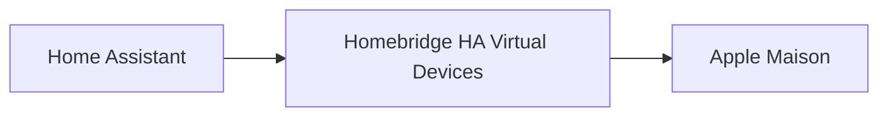

# Homebridge HA Virtual Devices

[](https://github.com/fmontant/homebridge-ha-virtual-devices/actions/workflows/build.yml)
[](https://www.npmjs.com/package/homebridge-ha-virtual-devices)
[](https://homebridge.io/)
[](https://www.home-assistant.io/)
[](https://nodejs.org/)
[](LICENSE)

Expose automatiquement les capteurs environnementaux compatibles de Home Assistant sous forme de thermostats natifs Apple Maison grâce à Homebridge.

Au lieu d'afficher séparément les capteurs de température, d'humidité et de batterie, le plugin regroupe intelligemment les mesures d'un même appareil dans une unique tuile Thermostat native.

Aucune configuration manuelle.

Aucun polling.

Aucun accessoire dupliqué.

Une expérience Apple Maison simple, propre et totalement native.

> La réalité avant tout.
> Toutes les captures d'écran présentées ci-dessous proviennent d'une installation réelle du plugin. Seules les informations personnelles ont été anonymisées.


---

# Pourquoi ce plugin ?

Home Assistant excelle dans la collecte des données provenant de centaines d'appareils.

Apple Maison offre l'une des meilleures expériences utilisateur pour piloter son habitation au quotidien.

Ce plugin réunit les deux.

Les capteurs environnementaux compatibles sont découverts automatiquement, regroupés intelligemment puis exposés sous forme de thermostats HomeKit natifs, sans aucune configuration complexe.

---

# Fonctionnalités

## Découverte automatique

- Découverte automatique des appareils compatibles Home Assistant
- Création automatique des accessoires HomeKit
- Regroupement automatique des mesures d'un même appareil
- Aucune configuration manuelle

## Intégration native Apple Maison

- Thermostats HomeKit natifs
- Température et humidité réunies dans une seule tuile
- Niveau de batterie optionnel
- Mise à jour en temps réel via l'API WebSocket de Home Assistant

## Informations de l'appareil

- Fabricant
- Modèle
- Version du firmware
- Version matérielle
- Numéro de série

## Configuration

- Configuration minimale
- Liste d'exclusion des appareils
- Synchronisation automatique

---

# Capteurs pris en charge

Actuellement

- Température
- Humidité
- Niveau de batterie

Prévu prochainement

- Qualité de l'air
- CO₂
- COV
- Pression atmosphérique
- Luminosité
- Autres capteurs environnementaux

---

# Pourquoi utiliser un thermostat ?

Apple Maison ne propose actuellement aucun type d'accessoire natif dédié aux capteurs environnementaux.

Parmi tous les accessoires HomeKit disponibles, le thermostat offre aujourd'hui la présentation la plus intuitive pour afficher les informations environnementales tout en respectant parfaitement les conventions d'interface d'Apple.

Le plugin ne crée jamais d'accessoires personnalisés.

Tous les accessoires exposés sont entièrement natifs HomeKit.

---

# Captures d'écran

Le plugin s'intègre naturellement dans Apple Maison.

Au lieu de créer plusieurs accessoires indépendants, les différentes mesures sont regroupées dans une seule tuile Thermostat.

| Vue d'ensemble | Thermostat | Informations |
|:--------------:|:----------:|:------------:|
|  |  |  |

---

# Architecture



Le plugin découvre automatiquement les capteurs environnementaux compatibles, regroupe les différentes mesures puis les expose sous forme d'accessoires natifs Apple Maison.

---

# Installation

Installation globale :

```bash
npm install -g homebridge-ha-virtual-devices
```

Redémarre Homebridge.

Configure le plugin.

Profite d'une intégration entièrement automatique.

---

# Configuration

Exemple :

```json
{
  "platform": "HAVirtualDevices",
  "name": "HA Virtual Devices",
  "host": "http://homeassistant.local:8123",
  "token": "YOUR_LONG_LIVED_ACCESS_TOKEN"
}
```

Deux paramètres sont obligatoires :

- L'adresse de Home Assistant
- Un Long-Lived Access Token

Après le redémarrage de Homebridge, les accessoires sont créés automatiquement.

---

# Compatibilité

- Homebridge 2.x
- Node.js 22 ou supérieur
- Home Assistant 2024.6 ou supérieur
- Apple Maison
- iOS 16 ou supérieur
- macOS 13 ou supérieur

---

# Feuille de route

Les prochaines versions intégreront notamment :

- Capteurs CO₂
- Capteurs de qualité de l'air
- Capteurs COV
- Capteurs de luminosité
- Capteurs de pression atmosphérique
- Découverte via Matter
- Options de filtrage avancées
- Diagnostics enrichis

---

# Contribuer

Les contributions sont les bienvenues.

N'hésite pas à proposer des idées, signaler un problème ou ouvrir une Pull Request.

---

# Licence

Ce projet est distribué sous licence MIT.

Consulte le fichier `LICENSE` pour plus d'informations.