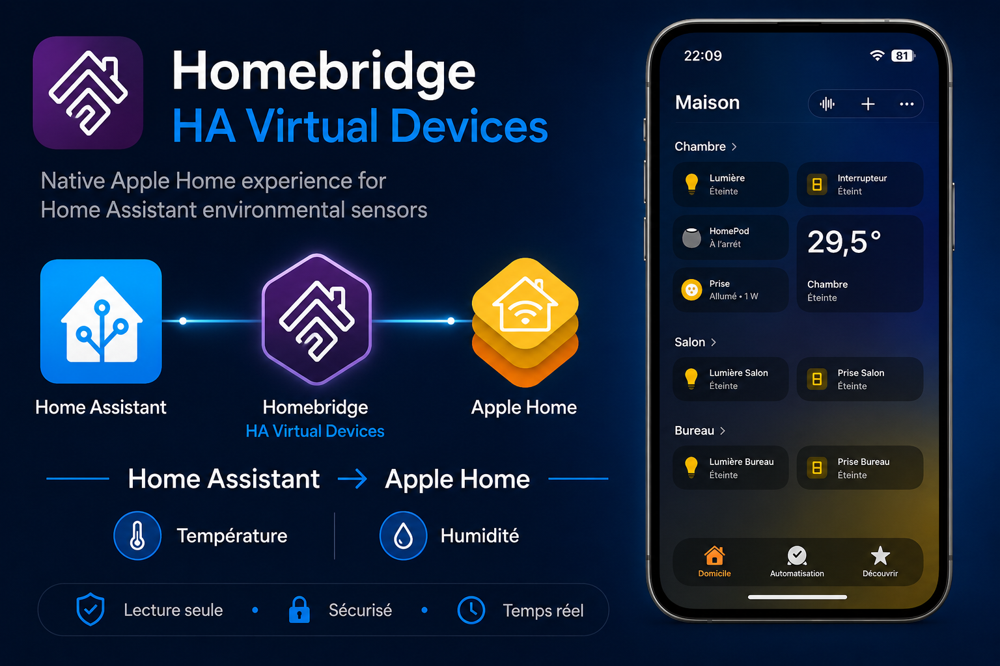

# Homebridge HA Virtual Devices

> Expose les capteurs environnementaux de Home Assistant sous forme d'accessoires HomeKit natifs via Homebridge.

[](https://github.com/fmontant/homebridge-ha-virtual-devices/actions/workflows/build.yml)
[](https://www.npmjs.com/package/homebridge-ha-virtual-devices)
[](https://homebridge.io/)
[](https://www.home-assistant.io/)
[](https://nodejs.org/)
[](LICENSE)



---

## Pourquoi ce plugin ?

Apple Maison permet d'afficher les capteurs de température, mais leur présentation reste limitée et ils sont souvent difficiles à identifier au sein de l'application.

Ce plugin transforme chaque capteur environnemental Home Assistant en un thermostat HomeKit en lecture seule, offrant une expérience utilisateur plus claire et plus cohérente.

Chaque accessoire affiche :

- La température actuelle.
- L'humidité relative (lorsqu'elle est disponible).
- Le niveau de batterie (lorsqu'il est disponible).
- L'état de disponibilité du capteur.

Aucune commande de chauffage ou de climatisation n'est exposée.

Les accessoires sont strictement destinés à la consultation des informations environnementales.

---

## Fonctionnalités

### Découverte automatique

- Découverte automatique des capteurs environnementaux compatibles dans Home Assistant.
- Création automatique des accessoires HomeKit correspondants.
- Synchronisation continue des appareils découverts.

### Synchronisation en temps réel

- Communication via l'API WebSocket de Home Assistant.
- Mise à jour immédiate des changements d'état.
- Détection des capteurs indisponibles.
- Reconnexion automatique après une perte de connexion.

### Catalogue persistant

Le plugin conserve un catalogue local des appareils découverts.

Pour chaque appareil, il mémorise notamment :

- les préférences utilisateur ;
- les favoris ;
- les appareils masqués ;
- les appareils archivés ;
- les dates de découverte et de dernière communication.

### Interface d'administration

L'interface Homebridge intégrée permet notamment de :

- parcourir le catalogue des appareils ;
- rechercher un appareil ;
- filtrer les appareils ;
- consulter les informations détaillées ;
- gérer les favoris ;
- masquer ou archiver des appareils ;
- modifier les préférences.

### Outils de développement

Le projet intègre un toolkit complet permettant d'automatiser les principales opérations de développement.

Les commandes disponibles incluent notamment :

| Commande | Description |
|----------|-------------|
| `npm run dev` | Déploie le plugin sur le NAS puis exécute un diagnostic complet |
| `npm run install-on-nas` | Compile et installe le plugin sur le NAS |
| `npm run doctor` | Vérifie l'environnement Homebridge et l'état du plugin |
| `npm run logs` | Consulte les journaux Homebridge avec ou sans filtre |
| `npm run prepare-release` | Prépare une nouvelle publication |
| `npm run release` | Publie le plugin sur npm |

La documentation complète est disponible dans :

```text
docs/developer-documentation/toolkit/
```

---

## Captures d'écran

### Apple Maison

Les thermostats virtuels apparaissent comme des accessoires HomeKit natifs dans l'application Maison.


Les informations disponibles dépendent des capacités du capteur :

- Température
- Humidité
- Niveau de batterie
- État de disponibilité

---

### Interface Homebridge

Le plugin intègre une interface d'administration directement dans Homebridge.

Elle permet notamment de :

- consulter le catalogue des appareils ;
- rechercher et filtrer les capteurs ;
- gérer les favoris ;
- masquer ou archiver des appareils ;
- modifier les préférences d'un appareil ;
- afficher des informations détaillées.


---

## Installation

### Depuis Homebridge

Rechercher :

```text
homebridge-ha-virtual-devices
```

Puis installer le plugin depuis l'interface Homebridge.

---

### Depuis npm

```bash
sudo npm install -g homebridge-ha-virtual-devices
```

---

## Configuration

Après l'installation :

1. Ouvrir les paramètres du plugin dans Homebridge.
2. Renseigner l'URL de Home Assistant.
3. Renseigner un jeton d'accès longue durée (Long-Lived Access Token).
4. Enregistrer la configuration.
5. Redémarrer Homebridge.

Le plugin découvre automatiquement les capteurs compatibles.

Aucune configuration manuelle des appareils n'est nécessaire.

---

## Exemple de configuration

```json
{
  "platform": "HAVirtualDevices",
  "name": "HA Virtual Devices",
  "haUrl": "http://homeassistant.local:8123",
  "token": "YOUR_LONG_LIVED_ACCESS_TOKEN"
}
```

---

## Appareils pris en charge

Le plugin détecte automatiquement les entités Home Assistant suivantes lorsqu'elles sont disponibles :

| Type | Pris en charge |
|-------|----------------|
| Température | ✅ |
| Humidité | ✅ |
| Batterie | ✅ |

Chaque appareil est exposé sous forme d'un thermostat HomeKit en lecture seule.

Les informations affichées dépendent des entités disponibles dans Home Assistant.

---

## Architecture

```text
                    Home Assistant
                           │
                  API WebSocket
                           │
                           ▼
        Homebridge HA Virtual Devices
                           │
            Gestionnaire d'appareils
                           │
                           ▼
               Accessoires HomeKit
                           │
                           ▼
                    Apple Maison
```

Le plugin surveille les changements d'état des capteurs Home Assistant et met automatiquement à jour les accessoires HomeKit correspondants.

---

## Documentation développeur

Documentation technique destinée aux développeurs et aux contributeurs.

Elle couvre notamment :

- Prise en main du projet
- Architecture du plugin
- Toolkit de développement
- Déploiement
- Publication des versions
- Dépannage
- Architecture Decision Records (ADR)
- Schémas techniques

Emplacement :

```text
docs/developer-documentation/
```

---

## Toolkit de développement

Le projet intègre un toolkit complet permettant d'automatiser le développement, le déploiement et le diagnostic du plugin.

| Commande | Description |
|----------|-------------|
| `npm run dev` | Déploie le plugin sur le NAS puis exécute un diagnostic complet |
| `npm run install-on-nas` | Compile et installe le plugin sur le NAS |
| `npm run doctor` | Vérifie l'environnement Homebridge et l'état du plugin |
| `npm run logs` | Consulte les journaux Homebridge avec ou sans filtre |
| `npm run prepare-release` | Prépare une nouvelle publication |
| `npm run release` | Publie le plugin sur npm |

La documentation complète est disponible dans :

```text
docs/developer-documentation/toolkit/
```

---

#### Évolutions du toolkit de développement

- Contrôles de diagnostic supplémentaires
- Amélioration des outils de dépannage
- Automatisation renforcée des tâches de développement
- Documentation développeur enrichie

---

## Feuille de route

Le projet continue d'évoluer avec un objectif clair : simplifier l'expérience Apple Maison tout en réduisant au maximum la configuration nécessaire.

### Court terme

#### Expérience utilisateur

- Opérations groupées sur le catalogue des appareils
- Nouveaux outils d'administration
- Amélioration de la gestion des appareils
- Outils de diagnostic enrichis

#### Évolutions du toolkit de développement

- Contrôles de diagnostic supplémentaires
- Amélioration des outils de dépannage
- Automatisation renforcée des tâches de développement
- Documentation développeur enrichie

---

### Moyen terme

#### Intégration Home Assistant

- Amélioration de la découverte des appareils
- Synchronisation plus robuste
- Nouvelles options de configuration

#### Capteurs environnementaux

Prise en charge de nouvelles entités Home Assistant, notamment :

- Qualité de l'air
- Dioxyde de carbone (CO₂)
- Composés organiques volatils (COV)
- Pression atmosphérique
- Luminosité

---

### Long terme

#### Intégration native à l'écosystème

Étudier les possibilités de réduire la dépendance à Home Assistant en exploitant, lorsque cela est techniquement possible, les informations déjà disponibles via Apple Maison et Matter.

L'objectif à long terme est de simplifier l'installation tout en conservant une expérience HomeKit entièrement native.

#### Pérennité du projet

- Amélioration continue de la documentation
- Développement des contributions de la communauté
- Maintenabilité à long terme
- Optimisation des performances

---

## Contribuer

Les contributions sont les bienvenues.

Vous pouvez contribuer en :

- signalant des anomalies ;
- proposant des améliorations ;
- enrichissant la documentation ;
- soumettant du code ;
- traduisant le projet.

Pour toute évolution importante, merci d'ouvrir une issue avant de commencer son développement.

---

## Support

Lors d'un signalement de problème, merci de préciser :

- la version de Homebridge ;
- la version de Node.js ;
- la version de Home Assistant ;
- la version du plugin ;
- les journaux (logs) pertinents ;
- les étapes permettant de reproduire le problème.

Des informations complètes facilitent l'identification et la résolution des problèmes.

---

## Licence

Licence MIT

Copyright (c) Fabrice Montant

---

## Remerciements

Un grand merci :

- à la communauté Homebridge ;
- à la communauté Home Assistant ;
- à toutes les personnes qui testent les nouvelles versions ;
- à toutes celles et ceux qui signalent des problèmes et proposent des améliorations.

Vos retours contribuent chaque jour à faire progresser ce projet.
