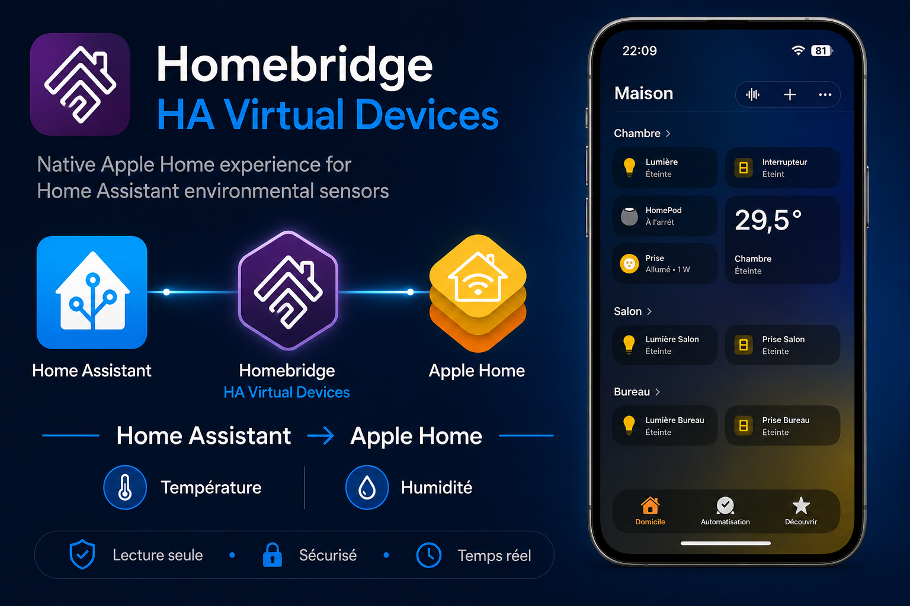
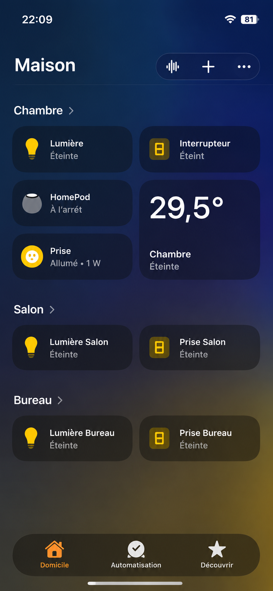
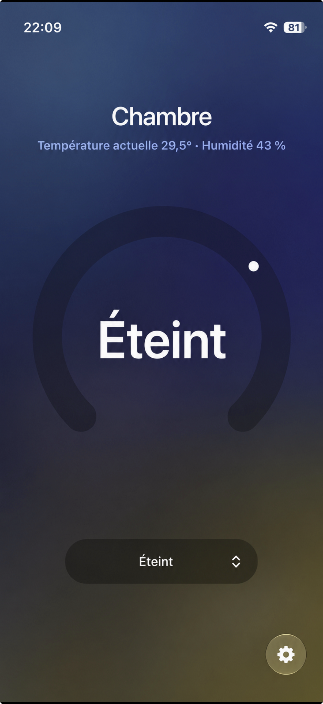
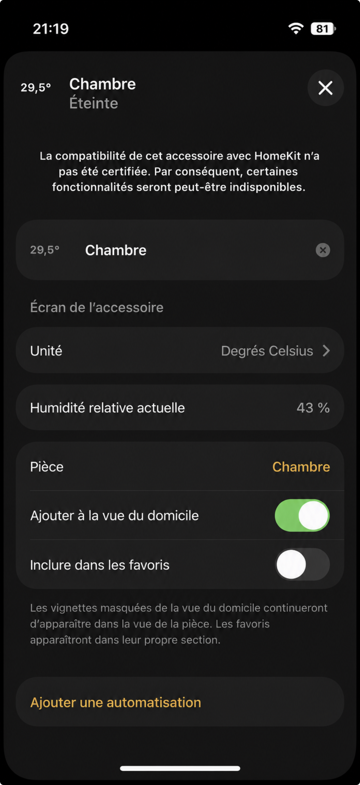
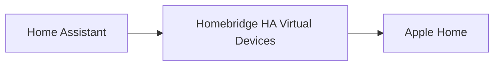

# Homebridge HA Virtual Devices

[](https://github.com/fmontant/homebridge-ha-virtual-devices/actions/workflows/build.yml)
[](https://www.npmjs.com/package/homebridge-ha-virtual-devices)
[](https://homebridge.io/)
[](https://www.home-assistant.io/)
[](https://nodejs.org/)
[](LICENSE)

Expose compatible Home Assistant environmental sensors as native Apple Home thermostat accessories through Homebridge.

Instead of displaying separate Temperature, Humidity and Battery accessories, the plugin intelligently groups related measurements into a single native Apple Home thermostat tile.

No manual mapping.

No polling.

No duplicated accessories.

Just a clean, native Apple Home experience.

> Reality first.
> Every screenshot shown below comes from a real installation of the plugin. Only personal information has been anonymized.



---

# Why this plugin?

Home Assistant excels at collecting data from hundreds of devices.

Apple Home excels at presenting that information in a clean and intuitive interface.

This plugin combines both worlds.

Compatible environmental sensors are automatically discovered, grouped and exposed as native HomeKit thermostat accessories without requiring any manual configuration.

---

# Features

## Automatic discovery

- Automatic discovery of compatible Home Assistant devices
- Automatic creation of HomeKit accessories
- Automatic grouping of related entities
- No manual configuration

## Native Apple Home integration

- Native HomeKit thermostat accessories
- Temperature and humidity displayed together
- Optional battery level
- Real-time updates through the Home Assistant WebSocket API

## Device information

- Manufacturer
- Model
- Firmware version
- Hardware version
- Serial number

## Configuration

- Simple configuration
- Device exclusion list
- Automatic synchronization

---

# Supported sensors

Currently supported

- Temperature
- Humidity
- Battery level

Planned

- Air quality
- CO₂
- VOC
- Atmospheric pressure
- Illuminance
- Additional environmental sensors

---

# Why thermostats?

Apple Home currently does not provide a native accessory dedicated to environmental sensors.

Among all native HomeKit accessory types, the thermostat provides the most natural user experience for displaying environmental information while preserving Apple's interface conventions.

The plugin never creates custom accessories.

Everything exposed to Apple Home is 100% native HomeKit.

---

# Screenshots

The plugin integrates naturally into Apple Home.

Instead of creating several independent accessories, measurements are grouped into a single thermostat tile.

| Apple Home overview | Thermostat | Accessory information |
|:-------------------:|:----------:|:---------------------:|
|  |  |  |

---

# Architecture



The plugin automatically discovers compatible environmental sensors, groups related measurements and exposes them as native Apple Home accessories.

---

# Installation

Install globally:

```bash
npm install -g homebridge-ha-virtual-devices
```

Restart Homebridge.

Configure the plugin.

Enjoy.

---

# Configuration

Example configuration

```json
{
  "platform": "HAVirtualDevices",
  "name": "HA Virtual Devices",
  "host": "http://homeassistant.local:8123",
  "token": "YOUR_LONG_LIVED_ACCESS_TOKEN"
}
```

Required parameters

- Home Assistant URL
- Long-Lived Access Token

After restarting Homebridge, accessories are created automatically.

---

# Compatibility

- Homebridge 2.x
- Node.js 22+
- Home Assistant 2024.6+
- Apple Home
- iOS 16+
- macOS 13+

---

# Roadmap

Upcoming features include

- CO₂ sensors
- Air quality sensors
- VOC sensors
- Illuminance sensors
- Pressure sensors
- Matter discovery
- Advanced filtering
- Extended diagnostics

---

# Contributing

Contributions are welcome.

Feel free to submit issues, ideas or pull requests.

---

# License

This project is licensed under the MIT License.

See the LICENSE file for details.